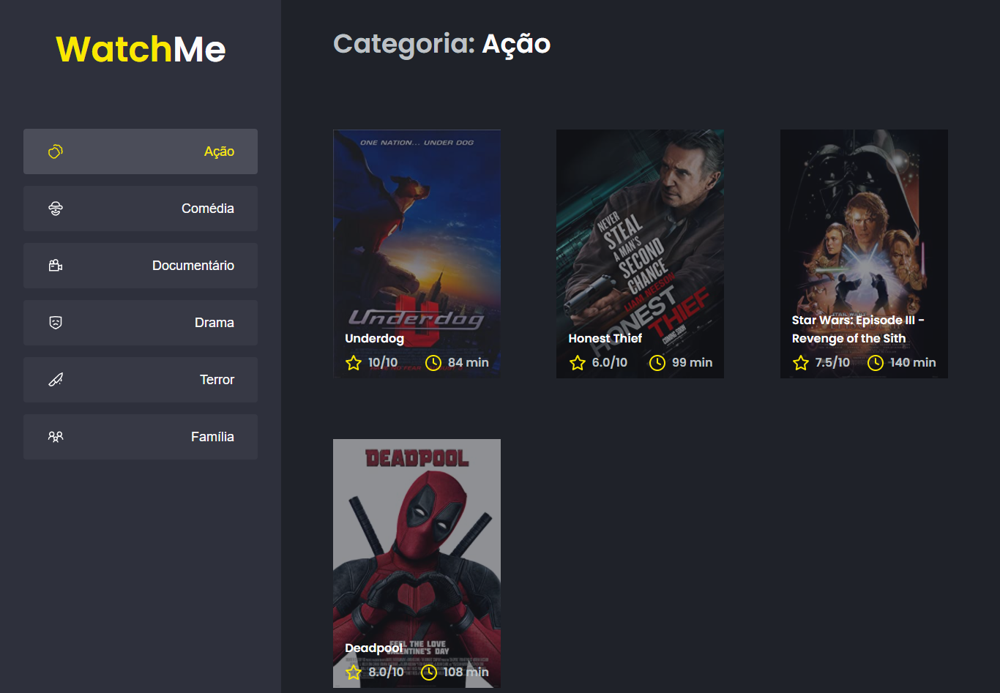

## Começando

Primeiro, execute o servidor de desenvolvimento:

```bash
npm install
# or
yarn install
```

Para executar o projeto:

```bash
npm run server
npm run dev
# or
yarn server
yarn dev
```

Abra (http: // localhost: 8080) com seu navegador para ver o resultado.

## Informações e Screens

Projeto de Listagem de Filmes

construido com Fake API (JSON Server).


